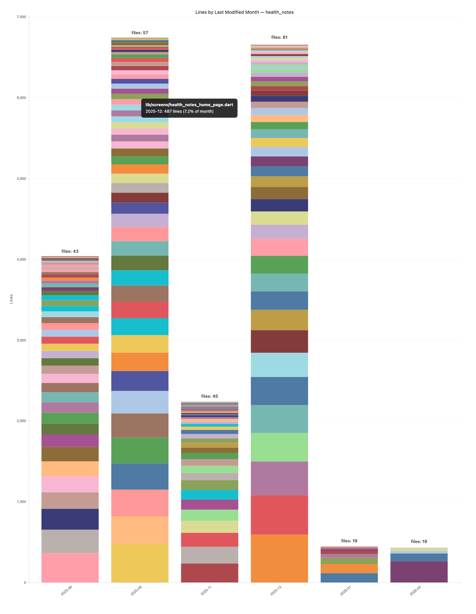

# flutter-line-age

Analyzes a Flutter/Dart repo's source code by the month each line was last touched, using `git blame`. Renders an interactive stacked bar chart where each bar represents a month and each colored segment is a file — sorted largest-at-bottom within each bar.



## What it shows

- **Bar height** — total lines last modified in that month
- **Colored segments** — individual files, sorted so the file with the most changes in that month sits at the bottom
- **files: N label** — number of distinct files touched in that month
- **Hover** — file name, line count, and percentage share of the month

## Requirements

- Python 3.10+
- Git

No third-party Python packages required. The chart is rendered client-side via [D3.js](https://d3js.org) (loaded from CDN).

## Install

```bash
pip install .
```

Or run directly without installing:

```bash
python flutter_line_age.py <path-to-repo>
```

## Usage

```
flutter-line-age <repo> [--exclude SUFFIX ...] [--output FILE]
```

| Argument | Description |
|---|---|
| `repo` | Path to the Flutter/Dart git repository |
| `--exclude` | Additional generated file suffixes to skip (e.g. `.custom.dart`) |
| `--output` | Save the chart to an HTML file instead of opening it in a browser |

### Examples

```bash
# Open chart interactively in the browser
flutter-line-age ~/code/my_app

# Save to an HTML file
flutter-line-age ~/code/my_app --output line_age.html

# Skip extra generated files
flutter-line-age ~/code/my_app --exclude .api.dart .pb.dart
```

## How it works

1. Finds all non-generated `.dart` files (skips `*.g.dart`, `*.freezed.dart`, etc. and `build/`, `.dart_tool/` directories)
2. Runs `git blame --line-porcelain` on each file to find the commit timestamp of every line
3. Buckets lines by `YYYY-MM` of their last commit
4. Renders a self-contained HTML file with an embedded D3.js stacked bar chart
